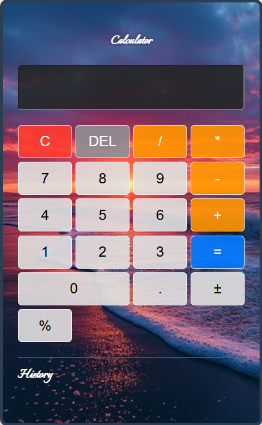

# 🧮 Sun-set Calculator

A fully functional web-based calculator with a beautiful sun-set background, calculation history, error handling, and deletable history entries. Built with **HTML**, **CSS**, and **JavaScript**.

## ✨ Features

- **Basic arithmetic** – addition, subtraction, multiplication, division  
- **Decimal support** – prevents multiple decimals in one number  
- **Sign toggle** (±) – switch between positive and negative  
- **Percentage** – divide current number by 100  
- **Clear & Delete** – clear all (`C`) or delete last character (`DEL`)  
- **Calculation history** – stores last 10 calculations  
- **Delete individual history entries** – each history item has a 🗑️ button  
- **Error messages** – shows invalid expressions (e.g., division by zero, syntax errors) and auto‑hides after 3 seconds  
- **Responsive design** – adapts to small screens  
- **Solid border** – clear visual definition  
- **Ocean background image** – fully visible, no overlay  

## 🖼️ Preview



## 📁 Project Structure


## 🚀 Getting Started

### Prerequisites
- Any modern web browser (Chrome, Firefox, Edge, Safari)
- A local server is **not required** – works directly from file system

### Installation

1. **Clone or download** this repository.
2. Place your desired background image in an `images` folder and name it `ocean.jpg` (or update the path in `style.css`).
3. Open `index.html` in your browser.

No build steps or dependencies – it’s pure HTML/CSS/JS.

## 🎮 Usage

| Button | Action |
|--------|--------|
| `0-9`  | Append digit |
| `.`    | Add decimal point |
| `+ - * /` | Append operator |
| `±`    | Toggle sign of current number |
| `%`    | Convert current number to percentage |
| `C`    | Clear entire display |
| `DEL`  | Delete last character |
| `=`    | Evaluate expression and add to history |
| 🗑️    | Delete a single history entry |

### Error Handling
- **Division by zero** → displays `Error` and shows message  
- **Invalid expression** (e.g., `2++3`) → error message  
- **Percentage on non‑number** → error message  

All error messages disappear automatically after 3 seconds.

## 🧩 Customisation

### Background image
Change the image path in `style.css`:
```css
background-image: url('your-folder/your-image.jpg');